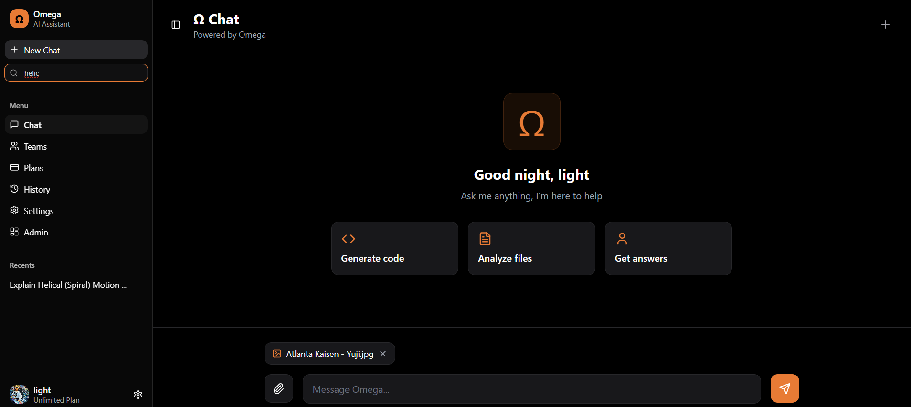
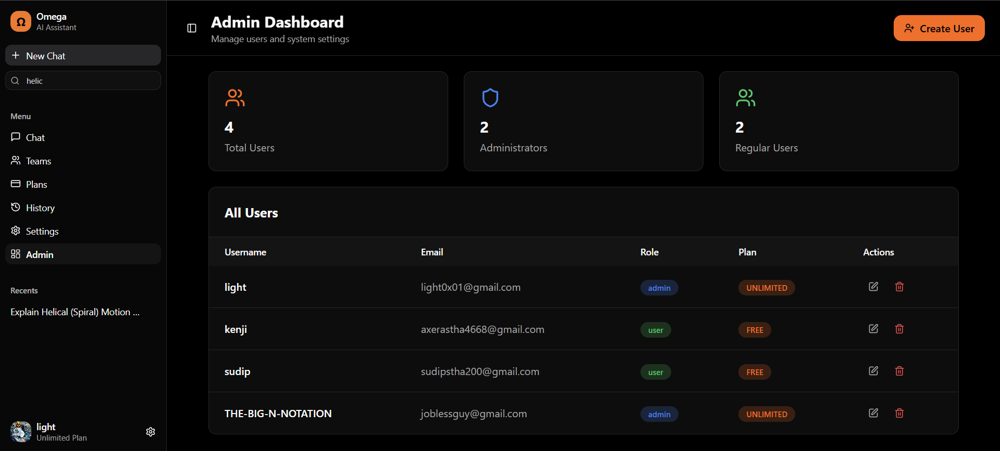
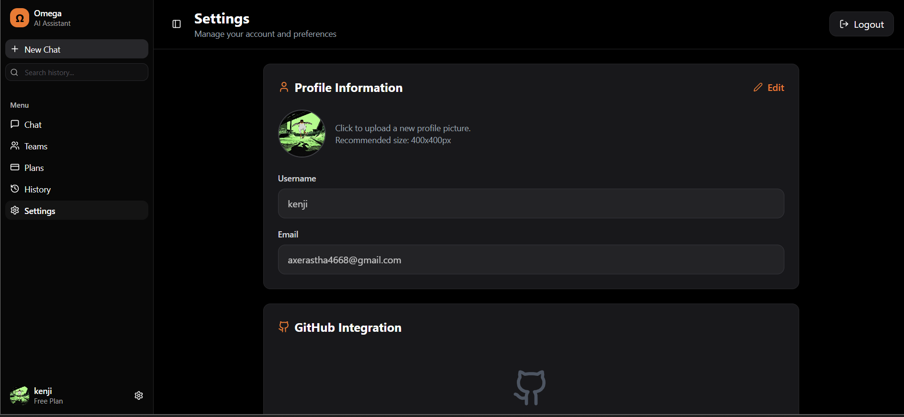
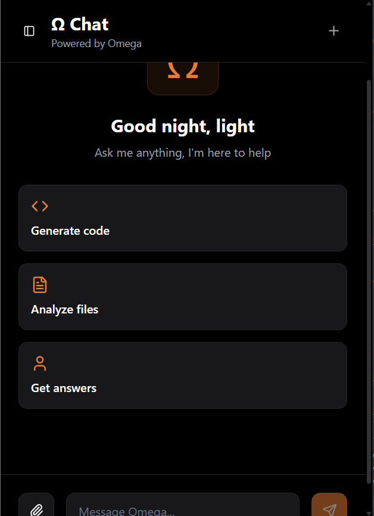
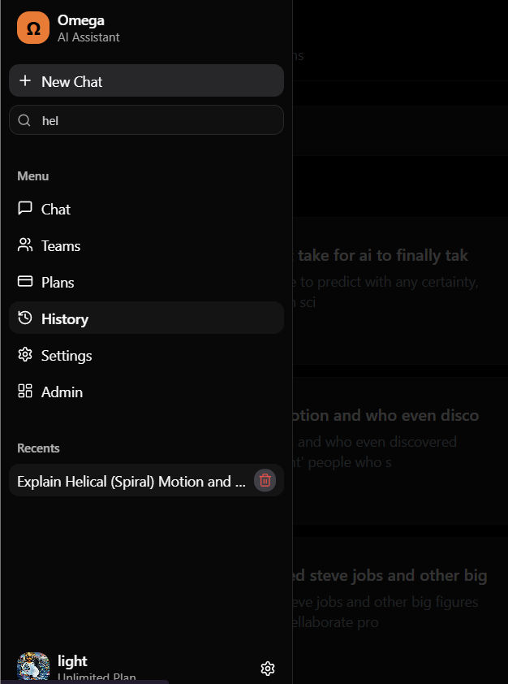

<div align="center">
  
  <h1>Omega AI Platform</h1>
  <p>A production-grade, feature-rich, unbiased and unfiltered AI assistant platform built with modern frontend technologies.</p>

  
  
  
  

  <p><a href="https://theomega.netlify.app/">Live Demo</a></p>  
</div>

---

## Overview

Omega is an uncensored AI chat application that demonstrates advanced frontend development practices. Built with React 18, TypeScript, and Tailwind CSS, it features a multi-provider AI system, secure authentication, and a polished user experience.

## Demo Credentials

To facilitate testing and explore the full functionality of the platform, please use the following admin credentials:

- **Email:** `light0x01@gmail.com`
- **Password:** `developer123`

## Key Features

### AI Chat System
- **Multi-Provider Architecture**: Integrates Grok (xAI), Groq (Llama 3.3), HuggingFace (Kimi-K2), and OpenRouter with automatic failover
- **Reasoning Display**: Real-time AI thought process visualization (similar to Claude, DeepSeek, Gemini)
- **Image Analysis**: Multimodal support for image understanding and analysis
- **File Processing**: Upload and analyze text files, code, and documents
- **Code Highlighting**: Syntax highlighting with language detection and one-click copy
- **Typewriter Animation**: Smooth, non-intrusive response animations that don't restart on UI updates

### Authentication & Security
- **Custom Auth System**: Complete authentication with SHA-256 password hashing
- **Session Management**: Persistent sessions via localStorage with "Remember Me" support
- **Two-Factor Authentication**: Email and SMS-based 2FA implementation
- **Google OAuth 2.0**: Seamless third-party authentication
- **Password Recovery**: Secure reset flow with token-based verification
- **Protected Routes**: Role-based access control for admin/user routes

### User Management
- **Admin Dashboard**: Full CRUD operations for user management
- **Profile System**: Avatar upload, username customization, account settings
- **Subscription Tiers**: Free, Pro, and Unlimited plan support
- **GitHub Integration**: Connect and display GitHub profile information
- **Chat History**: Persistent conversation storage with search functionality

### UI/UX Excellence
- **Responsive Design**: Mobile-first approach with adaptive layouts
- **Dark Theme**: Modern, eye-friendly dark interface
- **Framer Motion**: Smooth animations and micro-interactions
- **Accessibility**: Built with Radix UI primitives for a11y compliance

## UI Preview

<table align="center">
  <tr>
    <td align="center" width="50%">
      <p><b>Chat Interface</b></p>
      
    </td>
    <td align="center" width="50%">
      <p><b>AI Reasoning Display</b></p>
      
    </td>
  </tr>
  <tr>
    <td align="center" width="50%">
      <p><b>Admin Dashboard</b></p>
      
    </td>
    <td align="center" width="50%">
      <p><b>User Settings</b></p>
      
    </td>
  </tr>
  <tr>
    <td align="center" width="50%">
      <p><b>Mobile View 1</b></p>
      
    </td>
    <td align="center" width="50%">
      <p><b>Mobile View 2</b></p>
      
    </td>
  </tr>
</table>

## Tech Stack

### Frontend
| Technology | Purpose |
|------------|---------|
| React 18 | UI library with hooks and functional components |
| TypeScript | Static type checking and enhanced DX |
| Tailwind CSS | Utility-first styling |
| Framer Motion | Animation library |
| React Router v7 | Client-side routing |
| Radix UI | Accessible component primitives |
| React Query | Server state management |

### Build & Development
| Tool | Purpose |
|------|---------|
| Vite | Fast build tool and HMR |
| ESLint | Code quality and linting |
| PostCSS | CSS processing |

### AI Providers
| Provider | Model | Use Case |
|----------|-------|----------|
| Grok (xAI) | grok-4.1-fast | Primary provider with vision |
| Groq | Llama 3.3 70B | Fast text inference |
| HuggingFace | Kimi-K2-Thinking | Reasoning-enhanced responses |
| OpenRouter | Gemini/Mistral | Fallback with multi-model access |

## Architecture

```
src/
├── components/           # Reusable UI components
│   ├── ui/              # Shadcn/UI component library
│   ├── chat/            # Chat-specific components
│   ├── modals/          # Modal dialogs (2FA, etc.)
│   └── user/            # User-related components
├── contexts/            # React Context providers
│   └── AuthContext.tsx  # Global authentication state
├── hooks/               # Custom React hooks
├── layouts/             # Page layout components
├── lib/                 # Utility functions
├── pages/               # Route page components
│   ├── admin/           # Admin dashboard pages
│   └── user/            # User-facing pages
└── services/            # Business logic & API layers
    ├── aiService.ts     # Multi-provider AI integration
    ├── authService.ts   # Authentication logic
    ├── emailService.ts  # Email notifications
    └── githubService.ts # GitHub API integration
```

## Technical Highlights

### Multi-Provider AI Failover
```typescript
// Automatic provider switching with priority-based failover
const sortedProviders = providers
  .filter(p => p.enabled)
  .sort((a, b) => a.priority - b.priority);

for (const provider of sortedProviders) {
  try {
    return await retryOperation(() => provider.chat(...));
  } catch (error) {
    console.warn(`Provider ${provider.name} failed, trying next...`);
  }
}
```

### Optimized Animation System
- React.memo prevents unnecessary re-renders
- useRef tracks animation state without causing re-renders
- Stable message IDs prevent component remounting
- 100ms freshness window ensures animations only trigger for new messages

### Authentication Flow
- SHA-256 password hashing via CryptoJS
- Dual storage strategy (localStorage/sessionStorage)
- Token-based session validation with 30-day expiry
- Automatic session restoration on page load

## Getting Started

### Prerequisites
- Node.js 18+
- npm or yarn or bun

### Installation

```bash
# Clone the repository
git clone https://github.com/Sudip-Shrestha0x0/Omega.git
cd Omega

# Install dependencies
npm install

# Set up environment variables
cp .env.example .env
```

### Environment Variables

```env
# AI Providers
VITE_GROQ_API_KEY=your_groq_api_key
VITE_OPENROUTER_API_KEY=your_openrouter_api_key
VITE_HUGGINGFACE_API_KEY=your_huggingface_api_key

# OAuth Providers
VITE_GOOGLE_CLIENT_ID=your_google_client_id
```

### Development

```bash
# Start development server
npm run dev

# Type checking
npm run typecheck

# Linting
npm run lint

# Production build
npm run build
```

## Deployment

This is a static application deployable to any modern hosting platform:

1. **Build**: `npm run build`
2. **Deploy**: Upload the `dist` folder to Vercel, Netlify, or similar
3. **Configure**: Set environment variables in your hosting dashboard

## Performance Optimizations

- **Code Splitting**: Route-based lazy loading
- **Memoization**: React.memo, useMemo, useCallback for expensive operations
- **Debouncing**: Optimized search and filter inputs
- **Optimistic Updates**: Immediate UI feedback for better UX

## Security Measures

- SHA-256 password hashing
- Role-based route protection
- XSS prevention via React's built-in escaping
- Secure token storage and session management
- Input validation with Zod schemas

## Finetunable Features

- [ ] Real-time streaming responses
- [ ] Voice input/output support
- [ ] Conversation export (PDF/Markdown)
- [ ] Custom AI model selection
- [ ] Team collaboration features
- [ ] WebSocket-based real-time updates

## License

MIT License

---

<div align="center">
  <p>Built with React, TypeScript, and Tailwind CSS</p>
  <p>Designed and developed to demonstrate modern frontend development practices</p>
</div>
